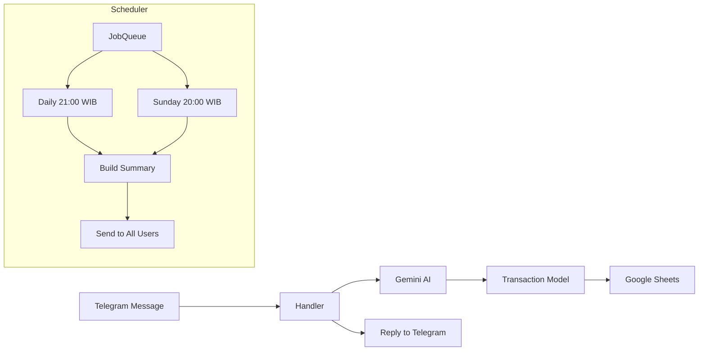

# Floe

Personal finance Telegram bot. Track your spending by sending a text message or a receipt photo. Powered by Google Gemini AI.

[](https://python.org)
[](https://github.com/astral-sh/ruff)
[](https://github.com/KadoBOT/ty)
[](LICENSE)

---

## Table of Contents

- [Floe](#floe)
  - [Table of Contents](#table-of-contents)
  - [Overview](#overview)
  - [Quick Start](#quick-start)
    - [Prerequisites](#prerequisites)
    - [Installation](#installation)
    - [Run](#run)
  - [Usage](#usage)
    - [Commands](#commands)
    - [Examples](#examples)
  - [Features](#features)
  - [Configuration](#configuration)
  - [Architecture](#architecture)
    - [Data flow](#data-flow)
  - [Tech Stack](#tech-stack)
  - [Development](#development)
    - [Commands](#commands-1)
    - [Code conventions](#code-conventions)
    - [Workflow](#workflow)
  - [Contributing](#contributing)
    - [Commit convention](#commit-convention)
  - [License](#license)

---

## Overview

Floe is a self-hosted Telegram bot that eliminates manual expense tracking. Send a message like `spent 50k for lunch at warteg` or snap a photo of a receipt. Gemini AI extracts the amount, category, and description, then logs the transaction to Google Sheets. Daily and weekly summaries are delivered automatically.

Built for individuals who want full control over their financial data. No third-party apps, no subscriptions, no ads. Your data lives in your own Google Sheets.

Unlike budgeting apps that require manual categorisation or paid subscriptions, Floe lets you interact naturally. Just type what you spent, and the AI handles the rest.

---

## Quick Start

### Prerequisites

- Python 3.12+
- [uv](https://docs.astral.sh/uv/) package manager
- Telegram bot token (from [@BotFather](https://t.me/BotFather))
- Google Gemini API key (from [Google AI Studio](https://aistudio.google.com))
- Google Cloud project with Sheets API and Drive API enabled, and a service account JSON file
- A Google Sheet to store transactions

### Installation

```bash
# Clone the repository
git clone https://github.com/yourusername/floe.git
cd floe

# Install dependencies
uv sync

# Create environment configuration
cp .env.example .env

# Edit .env with your credentials (see Configuration section)
```

### Run

```bash
uv run python -m floe.main
```

Expected output:

```
2026-05-12 10:00:00 | floe.main | INFO | Floe Finance Tracker starting up...
2026-05-12 10:00:01 | floe.main | INFO | Bot siap. Mulai polling...
```

Send `/start` to your bot on Telegram. The bot replies with a welcome message, and you can begin recording transactions.

---

## Usage

### Commands

| Command                      | Description                                      |
| ---------------------------- | ------------------------------------------------ |
| `/start`                     | Initialize the bot and receive a welcome message |
| `/help`                      | Show all available commands                      |
| `/summary`                   | Get today's transaction summary                  |
| `/weekly`                    | Get this week's transaction summary              |
| `/delete`                    | Remove the last recorded transaction             |
| `/export`                    | Download this month's transactions as a CSV file |
| `/budget <kategori> <limit>` | Set a monthly budget limit for a category        |

### Examples

**Text message (pengeluaran):**

```
You: spent 35000 for nasi padang
Bot: Rp35.000 | Makanan | nasi padang
```

**Text message (pemasukan):**

```
You: gaji bulan ini 5 juta
Bot: +Rp5.000.000 | Pemasukan | gaji bulan ini
```

**Photo message:**

Send a photo of a receipt. Gemini Vision extracts the text, identifies the total, the category, and the description, then logs the transaction. The bot replies with the parsed result.

**Non-transaction:**

```
You: hello how are you
Bot: I can't find a transaction in that message.
```

**Budget limit exceeded:**

```
You: spent 200000 for elektronik
Bot: +Rp200.000 | Elektronik | beli kabel

Peringatan: Budget Elektronik sudah terpakai Rp950.000 dari limit Rp1.000.000.
```

---

## Features

- **AI-powered parsing.** Gemini extracts amount, category, and description from natural language and receipt photos. Supports Indonesian shorthand (`rb`, `jt`) and various number formats.
- **Google Sheets storage.** All transactions stored in your own spreadsheet, one sheet tab per user. No vendor lock-in.
- **Multi-user support.** Whitelist-based access control. Each user's transactions are isolated in their own tab.
- **Automatic summaries.** Daily summary at 21:00 WIB and weekly summary every Sunday at 20:00 WIB, delivered to each user.
- **Budget alerts.** Set monthly spending limits per category. Get a warning immediately when you exceed the limit.
- **CSV export.** Download the current month's transactions for external analysis in Excel or other tools.
- **Delete support.** Remove the last transaction if you made a mistake.
- **Webhook or polling.** Choose between webhook mode (for deployment on Railway or similar) or long polling (for local 24/7 setups).

---

## Configuration

All configuration is via environment variables in a `.env` file. Copy `.env.example` and fill in your values.

| Variable                      | Required | Default                 | Description                                                  |
| ----------------------------- | -------- | ----------------------- | ------------------------------------------------------------ |
| `TELEGRAM_BOT_TOKEN`          | Yes      | —                       | Token from [@BotFather](https://t.me/BotFather)              |
| `ALLOWED_USER_IDS`            | Yes      | —                       | Comma-separated Telegram user IDs allowed to use the bot     |
| `GEMINI_API_KEY`              | Yes      | —                       | API key from [Google AI Studio](https://aistudio.google.com) |
| `SPREADSHEET_ID`              | Yes      | —                       | ID from your Google Sheets URL                               |
| `GOOGLE_SERVICE_ACCOUNT_FILE` | No       | `service_account.json`  | Path to the service account JSON file                        |
| `GEMINI_MODEL`                | No       | `gemini-2.0-flash-lite` | Gemini model name                                            |
| `WEBHOOK_URL`                 | No       | —                       | Public URL for webhook mode (uses polling if unset)          |
| `WEBHOOK_SECRET`              | No       | —                       | Secret token for Telegram webhook verification               |
| `PORT`                        | No       | `8080`                  | Port for the webhook server                                  |
| `DAILY_SUMMARY_TIME`          | No       | `21:00`                 | Daily summary delivery time (WIB)                            |
| `WEEKLY_SUMMARY_DAY`          | No       | `sunday`                | Weekly summary day                                           |
| `WEEKLY_SUMMARY_TIME`         | No       | `20:00`                 | Weekly summary delivery time (WIB)                           |

---

## Architecture



### Data flow

1. User sends a text message or photo to the Telegram bot.
2. Handler checks access against `ALLOWED_USER_IDS`, then forwards to Gemini AI.
3. Gemini parses the message using a structured output schema (Pydantic model) and returns the extracted fields: amount, category, transaction type, and description.
4. The transaction is appended to the user's sheet tab in Google Sheets.
5. Bot sends a confirmation reply to the user with the parsed details.
6. If the transaction exceeds a budget limit, an additional warning is sent.
7. The scheduler delivers daily and weekly summaries at the configured times to all allowed users.

---

## Tech Stack

- **Python 3.12** — Runtime
- **python-telegram-bot** — Telegram Bot API with JobQueue scheduler
- **google-genai** — Gemini AI SDK (v2) with structured output
- **gspread** — Google Sheets client
- **Polars** — Data processing (DataFrame operations)
- **Pydantic** — Data models, validation, and response schemas
- **Pydantic Settings** — Environment variable loading and validation
- **Ruff** — Linter and formatter
- **Ty** — Static type checker
- **pytest** — Test runner
- **tenacity** — Retry logic with exponential backoff for API calls

---

## Development

### Commands

```bash
# Format code
uv run ruff format src/

# Lint
uv run ruff check src/

# Type check
uv run ty check src/

# Run tests
uv run pytest

# Run bot locally
uv run python -m floe.main
```

### Code conventions

- Line length: 100
- String quotes: double (enforced by Ruff)
- Ruff rulesets: E4, E7, E9, F, B, I, UP
- Docstring code formatting: enabled
- Type hints required for all function parameters and return values
- Logging with module-level logger (not `print`)

### Workflow

1. Create a branch: `feat/<issue-number>-<slug>`
2. Make atomic commits with conventional commit messages
3. Before submitting: `ruff format`, `ruff check`, `ty check`, `pytest`
4. Open a pull request against `main`

---

## Contributing

Contributions are welcome. Please follow these steps:

1. Open an issue to discuss the change you want to make.
2. Fork the repository.
3. Create a branch following the naming convention: `feat/<issue-number>-<slug>`.
4. Make atomic commits with conventional commit messages.
5. Run `ruff format`, `ruff check`, `ty check`, and `pytest` before submitting.
6. Open a pull request.

### Commit convention

```
type(scope): description
```

Types: `feat`, `fix`, `refactor`, `test`, `docs`, `chore`.

---

## License

MIT
